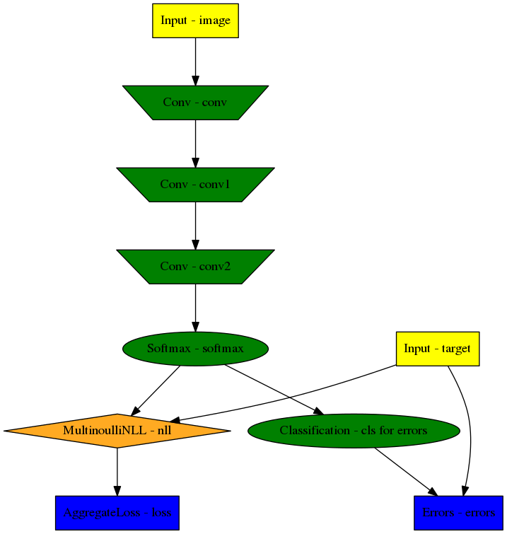

.. |br| raw:: html

    

.. _examples:

********
Examples
********

.. note::
   This page is currently under construction.
   Many content updates are in the works.

This page gives examples for different use cases of ELEKTRONN2. Besides, the
examples are intended to give an idea of how custom network architectures
could be created and trained without the built-in pipeline. To understand the
examples, basic knowledge of neural networks is recommended.

.. contents::
   :local:
   :depth: 2

A simple 3D CNN
===============

This example demonstrates how a 3-dimensional CNN and its loss function are
specified. The model batch size is 10 and the CNN takes an [23, 183, 183] image
volume with 3 channels [#f1]_ (e.g. RGB colours) as input.

.. [#f1] For consistency reasons the axis containing image channels and the axis
   containing classification targets are also denoted by ``'f'`` like the
   feature maps or features of a MLP.

Defining the neural network model
---------------------------------

The following code snippet [#f2]_ exemplifies how a 3-dimensional CNN model can be
built using ELEKTRONN2.

.. [#f2] For complete network config files that you can directly run with little
   to no modification, see the `"examples" directory
   <https://github.com/ELEKTRONN/ELEKTRONN2/tree/master/examples>`_ in the code
   repository.

.. code-block:: python

   from elektronn2 import neuromancer

   image = neuromancer.Input((10, 3, 23, 183, 183), 'b,f,z,x,y', name='image')

   # If no node name is given, default names and enumeration are used.
   # 3d convolution with 32 filters of size (1,6,6) and max-pool sizes (1,2,2).
   conv0 = neuromancer.Conv(image, 32, (1,6,6), (1,2,2))
   conv1 = neuromancer.Conv(conv0, 64, (4,6,6), (2,2,2))
   conv2 = neuromancer.Conv(conv1, 5, (3,3,3), (1,1,1), activation_func='lin')

   # Softmax automatically infers from the input's 'f' axis
   # that the number of classes is 5 and the axis index is 1.
   class_probs = neuromancer.Softmax(conv2)

   # This copies shape and strides from class_probs but the feature axis
   # is overridden to 1, the target array has only one feature on this axis,
   # the class IDs i.e. 'sparse' labels. It is also possible to use 5
   # features where each contains the probability for the corresponding class.
   target = neuromancer.Input_like(class_probs, override_f=1, name='target', dtype='int16')

   # Voxel-wise loss calculation
   voxel_loss = neuromancer.MultinoulliNLL(class_probs, target, target_is_sparse=True)
   scalar_loss = neuromancer.AggregateLoss(voxel_loss , name='loss')

   # Takes class with largest predicted probability and calculates classification accuracy.
   errors = neuromancer.Errors(class_probs, target, target_is_sparse=True)

   # Creation of nodes has been tracked and they were associated to a model object.
   model = neuromancer.model_manager.getmodel()
   model.designate_nodes(input_node=image, target_node=target, loss_node=scalar_loss,
   prediction_node=class_probs, prediction_ext=[scalar_loss, errors, class_probs])

``model.designate_nodes()`` triggers printing of aggregated model stats and
extended shape properties of the ``prediction_node``. |br|
Executing the above model creation code prints basic information for each node
and its output shape and saves it to the log file. |br|
Example output::

   <Input-Node> 'image'
   Out:[(10,b), (3,f), (23,z), (183,x), (183,y)]
   ---------------------------------------------------------------------------------------
   <Conv-Node> 'conv'
   #Params=3,488 Comp.Cost=25.2 Giga Ops, Out:[(10,b), (32,f), (23,z), (89,x), (89,y)]
   n_f=32, 3d conv, kernel=(1, 6, 6), pool=(1, 2, 2), act='relu',
   ---------------------------------------------------------------------------------------
   <Conv-Node> 'conv1'
   #Params=294,976 Comp.Cost=416.2 Giga Ops, Out:[(10,b), (64,f), (10,z), (42,x), (42,y)]
   n_f=64, 3d conv, kernel=(4, 6, 6), pool=(2, 2, 2), act='relu',
   ---------------------------------------------------------------------------------------
   <Conv-Node> 'conv2'
   #Params=8,645 Comp.Cost=1.1 Giga Ops, Out:[(10,b), (5,f), (8,z), (40,x), (40,y)]
   n_f=5, 3d conv, kernel=(3, 3, 3), pool=(1, 1, 1), act='lin',
   ---------------------------------------------------------------------------------------
   <Softmax-Node> 'softmax'
   Comp.Cost=640.0 kilo Ops, Out:[(10,b), (5,f), (8,z), (40,x), (40,y)]
   ---------------------------------------------------------------------------------------
   <Input-Node> 'target'
   Out:[(10,b), (1,f), (8,z), (40,x), (40,y)]
   85
   ---------------------------------------------------------------------------------------
   <MultinoulliNLL-Node> 'nll'
   Comp.Cost=640.0 kilo Ops, Out:[(10,b), (1,f), (8,z), (40,x), (40,y)]
   Order of sources=['image', 'target'],
   ---------------------------------------------------------------------------------------
   <AggregateLoss-Node> 'loss'
   Comp.Cost=128.0 kilo Ops, Out:[(1,f)]
   Order of sources=['image', 'target'],
   ---------------------------------------------------------------------------------------
   <_Errors-Node> 'errors'
   Comp.Cost=128.0 kilo Ops, Out:[(1,f)]
   Order of sources=['image', 'target'],
   Prediction properties:
   [(10,b), (5,f), (8,z), (40,x), (40,y)]
   fov=[9, 27, 27], offsets=[4, 13, 13], strides=[2 4 4], spatial shape=[8, 40, 40]
   Total Computational Cost of Model: 442.5 Giga Ops
   Total number of trainable parameters: 307,109.
   Computational Cost per pixel: 34.6 Mega Ops

Interactive usage of the ``Model`` and ``Node`` objects
-------------------------------------------------------

``Node`` objects can be used like functions to calculate their output. |br|
The first call triggers compilation and caches the compiled function::

   >>> test_output = class_probs(test_image)
   Compiling softmax, inputs=[image]
   Compiling done - in 21.32 s
   >>> import numpy as np
   >>> np.allclose(test_output, reference_output)
   True

The ``model`` object has a ``dict`` interface to its ``Node``\s::

   >>> model
   ['image', 'conv', 'conv1', 'conv2', 'softmax', 'target', 'nll', 'loss', 'cls for errors', 'errors']
   >>> model['nll'] == voxel_loss
   True
   >>> conv2.shape.ext_repr
   '[(10,b), (5,f), (8,z), (40,x), (40,y)]\nfov=[9, 27, 27], offsets=[4, 13, 13],
   strides=[2 4 4], spatial shape=[8, 40, 40]'
   >>> target.measure_exectime(n_samples=5, n_warmup=4)
   Compiling target, inputs=[target]
   Compiling done - in 0.65 s
   86
   target samples in ms:
   [ 0.019 0.019 0.019 0.019 0.019]
   target: median execution time: 0.01903 ms

For efficient dense prediction, batch size is changed to 1 and MFP  is inserted. |br|
To do that, the ``model`` must be rebuilt/reloaded. |br|
MFP needs a different patch size. The closest possible one is selected::

   >>> model_prediction = neuromancer.model.rebuild_model(model, imposed_batch_size=1,
                                                          override_mfp_to_active=True)
   patch_size (23) changed to (22) (size not possible)
   patch_size (183) changed to (182) (size not possible)
   patch_size (183) changed to (182) (size not possible)
   ---------------------------------------------------------------------------------------
   <Input-Node> 'image'
   Out:[(1,b), (3,f), (22,z), (182,x), (182,y)]
   ...

Dense prediction: ``test_image`` can have any spatial shape as long as it
is larger than the ``model`` patch size::

   >>> model_prediction.predict_dense(test_image, pad_raw=True)
   Compiling softmax, inputs=[image]
   Compiling done - in 27.63 s
   Predicting img (3, 58, 326, 326) in 16 Blocks: (4, 2, 2)
   ...

The whole model can also be plotted as a graph by using the
``elektronn2.utils.d3viz.visualize_model()`` method::

   >>> from elektronn2.utils.d3viz import visualise_model
   >>> visualise_model(model, '/tmp/modelgraph')

   Model graph of the example CNN. Inputs are yellow and outputs are blue. |br|
   Some node classes are represented by special shapes, the default shape is oval.
