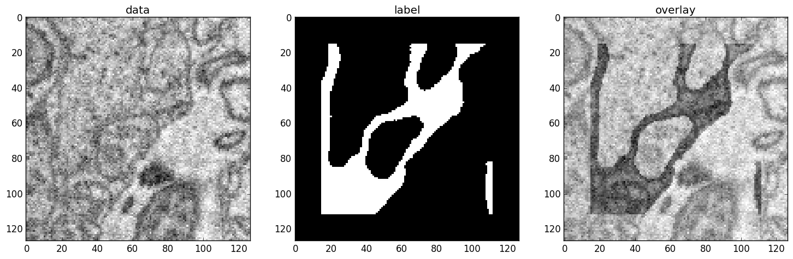

.. |br| raw:: html

   

.. .. _examples:

********
Examples
********

.. note::
  This page is currently under construction.
  Many content updates are in the works.

This page gives examples for different use cases of ELEKTRONN2. Besides, the
examples are intended to give an idea of how custom network architectures
could be created and trained without the built-in pipeline. To understand the
examples, basic knowledge of neural networks is recommended.

.. contents::
  :local:
  :depth: 2

3D CNN architecture and concepts
================================

Here we explain how a simple 3-dimensional CNN and its loss function can be
specified in ELEKTRONN2. The model batch size is 10 and the CNN takes an
[23, 183, 183] image volume with 3 channels [#f1]_ (e.g. RGB colours) as input.

.. [#f1] For consistency reasons the axis containing image channels and the axis
  containing classification targets are also denoted by ``'f'`` like the
  feature maps or features of a MLP.

Defining the neural network model
---------------------------------

The following code snippet [#f2]_ exemplifies how a 3-dimensional CNN model can be
built using ELEKTRONN2.

.. [#f2] For complete network config files that you can directly run with little
  to no modification, see the `3d Neuro Data <neuro3d>`_ section below and the `"examples" directory
  <https://github.com/ELEKTRONN/ELEKTRONN2/tree/master/examples>`_ in the code
  repository, especially
  `neuro3d.py <https://github.com/ELEKTRONN/ELEKTRONN2/blob/master/examples/neuro3d.py>`_.

.. _cnn_code:

.. code-block:: python

  from elektronn2 import neuromancer

  # Input shape: (batch size, number of features/channels, z, x, y)
  image = neuromancer.Input((10, 3, 23, 183, 183), 'b,f,z,x,y', name='image')

  # If no node name is given, default names and enumeration are used.
  # 3d convolution with 32 filters of size (1,6,6) and max-pool sizes (1,2,2).
  # Node constructors always receive their parent node as the first argument
  # (except for the root nodes like the 'image' node here).
  conv0 = neuromancer.Conv(image, 32, (1,6,6), (1,2,2))
  conv1 = neuromancer.Conv(conv0, 64, (4,6,6), (2,2,2))
  conv2 = neuromancer.Conv(conv1, 5, (3,3,3), (1,1,1), activation_func='lin')

  # Softmax automatically infers from the input's 'f' axis
  # that the number of classes is 5 and the axis index is 1.
  class_probs = neuromancer.Softmax(conv2)

  # This copies shape and strides from class_probs but the feature axis
  # is overridden to 1, the target array has only one feature on this axis,
  # the class IDs i.e. 'sparse' labels. It is also possible to use 5
  # features where each contains the probability for the corresponding class.
  target = neuromancer.Input_like(class_probs, override_f=1, name='target', dtype='int16')

  # Voxel-wise loss calculation
  voxel_loss = neuromancer.MultinoulliNLL(class_probs, target, target_is_sparse=True)
  scalar_loss = neuromancer.AggregateLoss(voxel_loss , name='loss')

  # Takes class with largest predicted probability and calculates classification accuracy.
  errors = neuromancer.Errors(class_probs, target, target_is_sparse=True)

  # Creation of nodes has been tracked and they were associated to a model object.
  model = neuromancer.model_manager.getmodel()

  # Tell the model which nodes fulfill which roles.
  # Intermediates nodes like conv1 do not need to be explicitly registered
  # because they only have to be known by their children.
  model.designate_nodes(
      input_node=image,
      target_node=target,
      loss_node=scalar_loss,
      prediction_node=class_probs,
      prediction_ext=[scalar_loss, errors, class_probs]
  )

``model.designate_nodes()`` triggers printing of aggregated model stats and
extended shape properties of the ``prediction_node``. |br|
Executing the above model creation code prints basic information for each node
and its output shape and saves it to the log file. |br|
Example output::

  <Input-Node> 'image'
  Out:[(10,b), (3,f), (23,z), (183,x), (183,y)]
  ---------------------------------------------------------------------------------------
  <Conv-Node> 'conv'
  #Params=3,488 Comp.Cost=25.2 Giga Ops, Out:[(10,b), (32,f), (23,z), (89,x), (89,y)]
  n_f=32, 3d conv, kernel=(1, 6, 6), pool=(1, 2, 2), act='relu',
  ---------------------------------------------------------------------------------------
  <Conv-Node> 'conv1'
  #Params=294,976 Comp.Cost=416.2 Giga Ops, Out:[(10,b), (64,f), (10,z), (42,x), (42,y)]
  n_f=64, 3d conv, kernel=(4, 6, 6), pool=(2, 2, 2), act='relu',
  ---------------------------------------------------------------------------------------
  <Conv-Node> 'conv2'
  #Params=8,645 Comp.Cost=1.1 Giga Ops, Out:[(10,b), (5,f), (8,z), (40,x), (40,y)]
  n_f=5, 3d conv, kernel=(3, 3, 3), pool=(1, 1, 1), act='lin',
  ---------------------------------------------------------------------------------------
  <Softmax-Node> 'softmax'
  Comp.Cost=640.0 kilo Ops, Out:[(10,b), (5,f), (8,z), (40,x), (40,y)]
  ---------------------------------------------------------------------------------------
  <Input-Node> 'target'
  Out:[(10,b), (1,f), (8,z), (40,x), (40,y)]
  85
  ---------------------------------------------------------------------------------------
  <MultinoulliNLL-Node> 'nll'
  Comp.Cost=640.0 kilo Ops, Out:[(10,b), (1,f), (8,z), (40,x), (40,y)]
  Order of sources=['image', 'target'],
  ---------------------------------------------------------------------------------------
  <AggregateLoss-Node> 'loss'
  Comp.Cost=128.0 kilo Ops, Out:[(1,f)]
  Order of sources=['image', 'target'],
  ---------------------------------------------------------------------------------------
  <_Errors-Node> 'errors'
  Comp.Cost=128.0 kilo Ops, Out:[(1,f)]
  Order of sources=['image', 'target'],
  Prediction properties:
  [(10,b), (5,f), (8,z), (40,x), (40,y)]
  fov=[9, 27, 27], offsets=[4, 13, 13], strides=[2 4 4], spatial shape=[8, 40, 40]
  Total Computational Cost of Model: 442.5 Giga Ops
  Total number of trainable parameters: 307,109.
  Computational Cost per pixel: 34.6 Mega Ops

Exploring ``Model`` and ``Node`` objects
----------------------------------------

The central concept in ELEKTRONN2 is that a neural network is represented as a
Graph of executable ``Node`` objects that are registered and organised in a
``Model``.

In general, we have one ``Model`` instance that is called ``model`` by
convention (see :py:class:`elektronn2.neuromancer.model.Model`.

All other variables here are instances of different subclasses of
:py:class:`Node <elektronn2.neuromancer.node_basic.Node>`, which are implemented
in the
:py:mod:`neuromancer.node_basic <elektronn2.neuromancer.node_basic>`,
:py:mod:`neuromancer.neural <elektronn2.neuromancer.neural>`,
:py:mod:`neuromancer.loss <elektronn2.neuromancer.loss>` and
:py:mod:`neuromancer.various <elektronn2.neuromancer.various>` submodules.

For more detailed information about ``Node`` and how its subclasses are derived,
see the ``Node`` :py:class:`API docs <elektronn2.neuromancer.node_basic.Node>`.

After executing the :ref:`above <cnn_code>` code (e.g. by ``%paste``-ing into
an ``ipython`` session or by running the whole file via ``elektronn2-train`` and
hitting ``Ctrl+C`` during training), you can play around with the
variables defined there to better understand how they work.

``Node`` objects can be used like functions to calculate their output. |br|
The first call triggers compilation and caches the compiled function::

  >>> import numpy as np
  >>> test_input = np.ones(shape=image.shape.shape, dtype=np.float32)
  >>> test_output = class_probs(test_input)
  Compiling softmax, inputs=[image]
  Compiling done - in 21.32 s
  >>> np.all(test_output > 0) and np.all(test_output < 1)
  True

The ``model`` object has a ``dict`` interface to its ``Node``\s::

  >>> model
  ['image', 'conv', 'conv1', 'conv2', 'softmax', 'target', 'nll', 'loss', 'cls for errors', 'errors']
  >>> model['nll'] == voxel_loss
  True
  >>> conv2.shape.ext_repr
  '[(10,b), (5,f), (8,z), (40,x), (40,y)]\nfov=[9, 27, 27], offsets=[4, 13, 13],
  strides=[2 4 4], spatial shape=[8, 40, 40]'
  >>> target.measure_exectime(n_samples=5, n_warmup=4)
  Compiling target, inputs=[target]
  Compiling done - in 0.65 s
  86
  target samples in ms:
  [ 0.019 0.019 0.019 0.019 0.019]
  target: median execution time: 0.01903 ms

For efficient dense prediction, batch size is changed to 1 and MFP  is inserted. |br|
To do that, the ``model`` must be rebuilt/reloaded. |br|
MFP needs a different patch size. The closest possible one is selected::

  >>> model_prediction = neuromancer.model.rebuild_model(model, imposed_batch_size=1,
                                                         override_mfp_to_active=True)
  patch_size (23) changed to (22) (size not possible)
  patch_size (183) changed to (182) (size not possible)
  patch_size (183) changed to (182) (size not possible)
  ---------------------------------------------------------------------------------------
  <Input-Node> 'image'
  Out:[(1,b), (3,f), (22,z), (182,x), (182,y)]
  ...

Dense prediction: ``test_image`` can have any spatial shape as long as it
is larger than the ``model`` patch size::

  >>> model_prediction.predict_dense(test_image, pad_raw=True)
  Compiling softmax, inputs=[image]
  Compiling done - in 27.63 s
  Predicting img (3, 58, 326, 326) in 16 Blocks: (4, 2, 2)
  ...

The whole model can also be plotted as a graph by using the
``elektronn2.utils.d3viz.visualize_model()`` method::

  >>> from elektronn2.utils.d3viz import visualise_model
  >>> visualise_model(model, '/tmp/modelgraph')

.. figure::  _images/example_model_graph.png

  Model graph of the example CNN. Inputs are yellow and outputs are blue. |br|
  Some node classes are represented by special shapes, the default shape is oval.

.. _neuro3d:

3D Neuro Data (``examples/neuro3d.py``)
=======================================
.. note::
  This section is under construction and is currently incomplete.

.. TODO: Link to data format description

In the following concrete example, ELEKTRONN2 is used for detecting neuron
cell boundaries in 3D electron microscopy image volumes.
The more general goal is to find a volume segmentation by
assigning a cell ID to each voxel. Predicting boundaries is a surrogate target
for which a CNN can be trained. The actual segmentation would be made by e.g.
running a `watershed transformation <https://en.wikipedia.org/wiki/Watershed_(image_processing)>`_
on the predicted boundary map. This is a typical *img-img* task.

For demonstration purposes, a relatively small CNN with only 3M parameters and 7
layers is used. It trains fast but is obviously limited in accuracy. To
solve this task well, more training data would be required in addition.

The full configuration file on which this section is based can be found in
ELEKTRONN2's `examples <https://github.com/ELEKTRONN/ELEKTRONN2/tree/master/examples>`_
folder as `neuro3d.py <https://github.com/ELEKTRONN/ELEKTRONN2/blob/master/examples/neuro3d.py>`_.
If your GPU is slow or you want to try ELEKTRONN2 on your CPU, we recommend
you use the `neuro3d_lite.py <https://github.com/ELEKTRONN/ELEKTRONN2/blob/master/examples/neuro3d_lite.py>`_
config instead. It uses the same data and has the same output format, but it
runs significantly faster (at the cost of accuracy).

Getting Started
---------------

.. TODO: Link to installation instructions. From here on ELEKTRONN2 is expected to be installed.

1. Download and unpack the `neuro_data_zxy test data <http://elektronn.org/downloads/neuro_data_zxy.zip>`_  (98 MiB)::

    wget http://elektronn.org/downloads/neuro_data_zxy.zip
    unzip neuro_data_zxy.zip -d ~/neuro_data_zxy

2. ``cd`` to the ``examples`` directory or download the example file to your working directory::

    wget https://raw.githubusercontent.com/ELEKTRONN/ELEKTRONN2/master/examples/neuro3d.py

4. Run::

    elektronn2-train neuro3d.py --gpu=auto

  During training, you can pause the neural network and enter the interactive
  shell interface by pressing ``Ctrl+C``. There you can directly inspect and
  modify all (hyper-)parameters and options of the training session.

.. TODO: Write a small introduction to the shell interface and link it here.

4. Inspect the printed output and the plots in the save directory

5. You can start experimenting with changes in the config file (for example by
   inserting a new ``Conv`` layer) and validate your model by directly running
   the config file through your Python interpreter before trying to train it::

    python neuro3d.py

Data Set
--------

This data set is a subset of the zebra finch area X dataset j0126 by
`Jörgen Kornfeld <http://www.neuro.mpg.de/mitarbeiter/43611/3242756>`_.
There are 3 volumes which contain "barrier" labels (union of cell boundaries
and extra cellular space) of shape ``(150,150,150)`` in ``(x,y,z)`` axis
order. Correspondingly, there are 3 volumes which contain raw electron
microscopy images. Because a CNN can only make predictions within some offset
from the input image extent, the size of the image cubes is larger
``(250,350,350)`` in order to be able to make predictions and to train
for every labelled voxel. The margin in this examples allows to make
predictions for the labelled region with a maximal field of view of
``201`` in  ``x, y`` and ``101`` in ``z``.

There is a difference in the lateral dimensions and in ``z`` - direction
because this data set is anisotropic: lateral voxels have a spacing of
:math:`10 \mu m` in contrast to :math:`20 \mu m` vertically. Snapshots
of images and labels are depicted below.

    An example slice of the neuro_data_zxy data set

    ============== ============== ======================================
    Left           Center         Right
    ============== ============== ======================================
    Raw input data Barrier labels Labels overlayed on top of input data.
    ============== ============== ======================================

During training, the pipeline cuts image and target patches from the loaded
data cubes at randomly sampled locations and feeds them to the CNN. Therefore
the CNN input size should be smaller than the size of the data cubes, to leave
enough space to cut from many different positions. Otherwise it will always
use the same patch (more or less) and soon over-fit to that one.

During training initialisation a debug plot of a randomly sampled batch is made
to check whether the training data is presented to the CNN in the intended way
and to find errors (e.g. image and label cubes are not matching or labels are
shifted w.r.t. images). Once the training loop has started, more such plots
can be made from the ELEKTRONN2 command line (``Ctrl+C``) ::

   >>> mfk@ELEKTRONN2: self.debug_getcnnbatch()

.. note::
  **Implementation details:** When the cubes are read into the pipeline, it
  is implicitly assumed that the smaller label cube is spatially centered
  w.r.t the larger image cube (hence the size surplus of the image cube must
  be even). Furthermore, for performance reasons the cubes are internally
  zero-padded to the same size and
  cropped such that only the area in which labels and images are both
  available after considering the CNN offset is used. If labels cannot be effectively
  used for training (because either the image surplus is too small or your FOV
  is too large) a note will be printed.

Additionally to the 3 pairs of images and labels, 2 small image cubes for live
previews are included. Note that preview data must be a **list** of one or
several cubes stored in a ``h5``-file.

Data and training options
-------------------------

In this section we explain selected training options in the
`neuro3d.py <https://github.com/ELEKTRONN/ELEKTRONN2/blob/master/examples/neuro3d.py>`_
config. Training options are usually specified at the top of the config file,
before the network model definition. They are parsed by the ``elektronn2-train``
application and processed and stored in the global ``ExperimentConfig``
:esrc:`object <training/trainutils.html#ExperimentConfig>`

preview_kwargs
^^^^^^^^^^^^^^

``preview_kwargs`` specifies how preview predictions are generated:

.. code-block:: python

  preview_kwargs = {
      'export_class': '1',
      'max_z_pred': 3
  }

* ``export_class`` is the list of class indices (channels) of
  predictions that are exported in the preview images. In the case of the
  *neuro_data_zxy* data set that we use here, ``1`` is the index of the "barrier"
  class, so the exported preview images should show a probability map of cell
  barriers. If you set it to ``'all'``, all predicted classes are exported in
  each preview process.
* ``max_z_pred`` defines how many subsequent z slices (i.e. images of the
  ``x, y`` plane) should be written to disk per preview prediction step).
  Limiting the values of these options can be useful to reduce clutter in your
  ``save_path`` directory.

.. note:: Internally, ``preview_kwargs`` specifies non-default arguments for
  :py:meth:`elektronn2.training.trainer.Trainer.preview_slice()`

data_init_kwargs
^^^^^^^^^^^^^^^^

``data_init_kwargs`` sets up where the training data is located and how it is
interpreted:

.. code-block:: python

  data_init_kwargs = {
      'd_path' : '~/neuro_data_zxy/',
      'l_path': '~/neuro_data_zxy/',
      'd_files': [('raw_%i.h5' %i, 'raw') for i in range(3)],
      'l_files': [('barrier_int16_%i.h5' %i, 'lab') for i in range(3)],
      'aniso_factor': 2,
      'valid_cubes': [2],
  }

* ``d_path``/``l_path``: Directory paths from which the input images/labels
  are read.
* ``d_files``: A list of tuples each consisting of a file name inside ``d_path``
  and the name of the hdf5 data set that should be read from it. (here
  the data sets are all named 'raw' and contain grayscale images of
  brain tissue).
* ``l_files``: A list of tuples each consisting of a file name inside ``l_path``
  and the hdf5 data set name. (here: label arrays named 'lab' that
  contain ground truth for cell barriers in the respective ``d_files``).
* ``aniso_factor``: Describes anisotropy in the first (``z``) axis of the given
  data. The data set used here demands an ``aniso_factor`` of 2 because
  lateral voxels biologically correspond to a spacing of :math:`10 \mu m`,
  whereas in ``z`` direction the spacing is :math:`20 \mu m`.
* ``valid_cubes``: Indices of training data sets that are reserved for
  validation and never used for training. Here, of the three training data cubes
  the last one (index ``2``) is used as validation data.
  All training data is stored inside the hdf5 files as 3-dimensional numpy
  arrays.

.. note:: Internally, ``data_init_kwargs`` specifies non-default arguments for
  the constructor of :py:class:`elektronn2.data.cnndata.BatchCreatorImage`

.. _data_batch_args_neuro3d:

data_batch_args
^^^^^^^^^^^^^^^

``data_batch_args`` determines how batches are prepared and how augmentation is
applied:

.. code-block:: python

  data_batch_args = {
      'grey_augment_channels': [0],
      'warp': 0.5,
      'warp_args': {
          'sample_aniso': True,
          'perspective': True
      }
  }

* ``grey_augment_channels``: List of channels for which grey-value augmentation
  should be applied. Our input images are grey-valued, i.e. they have
  only 1 channel (with index ``0``). For this channel grey value augmentations
  (randomised histogram distortions) are applied when sampling batches during
  training. This helps to achieve invariance against varying contrast and
  brightness gradients.
* ``warp``: Fraction of image samples to which warping transformations are
  applied (see :py:meth:`elektronn2.data.transformations.get_warped_slice()`)
* ``warp_args``: Non-default arguments passed to
  :py:meth:`elektronn2.data.cnndata.BatchCreatorImage.warp_cut()`

  - ``sample_aniso``: Scale ``z`` coordinates by the ``aniso_factor``-warp-arg
    (which defaults to 2, as needed for the neuro_data_xzy data set)
  - ``perspective``: Apply random
    `perspective <https://en.wikipedia.org/wiki/Transformation_matrix#Other_kinds_of_transformations>`_
    transformations while warping (in extension to affine transformations,
    which are used default).

.. note:: Internally, ``data_batch_args`` specifies non-default arguments for
  :py:meth:`elektronn2.data.cnndata.BatchCreatorImage.getbatch()`

.. _optimiser_neuro3d:

optimiser, optimiser_params
^^^^^^^^^^^^^^^^^^^^^^^^^^^

.. code-block:: python

  optimiser = 'Adam'
  optimiser_params = {
      'lr': 0.0005,
      'mom': 0.9,
      'beta2': 0.999,
      'wd': 0.5e-4
  }

* ``optimiser``: We choose the `Adam <https://arxiv.org/abs/1412.6980>`_
  optimiser because it is known to work well with our data set.
  Alternative optimisers are ``'AdaDelta'``, ``'AdaGrad'`` and ``'SGD'``
  (see implementations in :py:mod:`elektronn2.neuromancer.optimiser`).

* ``optimiser_params``:

  - ``lr``: Learning rate (:math:`\alpha`).
  - ``mom``: `Momentum <http://distill.pub/2017/momentum/>`_.
  - ``beta2``: :math:`\beta_{2}`, i.e. exponential decay rate for *Adam*'s moment
    estimates. (only applicable to the *Adam* optimiser!)
  - ``wd``: `Weight decay <https://papers.nips.cc/paper/563-a-simple-weight-decay-can-improve-generalization.pdf>`_.

.. _neuro3d_model:

CNN design
----------

.. TODO: Link to mfp section at the end of the 4th and 6th bullet point.

The architecture of the CNN is determined by the body of the ``create_model``
function inside the `network config file <https://github.com/ELEKTRONN/ELEKTRONN2/blob/master/examples/neuro3d.py#L46>`_:

.. code-block:: python

  from elektronn2 import neuromancer
  in_sh = (None,1,23,185,185)
  inp = neuromancer.Input(in_sh, 'b,f,z,x,y', name='raw')

  out   = neuromancer.Conv(inp, 20,  (1,6,6), (1,2,2))
  out   = neuromancer.Conv(out, 30,  (1,5,5), (1,2,2))
  out   = neuromancer.Conv(out, 40,  (1,5,5), (1,1,1))
  out   = neuromancer.Conv(out, 80,  (4,4,4), (2,1,1))

  out   = neuromancer.Conv(out, 100, (3,4,4), (1,1,1))
  out   = neuromancer.Conv(out, 100, (3,4,4), (1,1,1))
  out   = neuromancer.Conv(out, 150, (2,4,4), (1,1,1))
  out   = neuromancer.Conv(out, 200, (1,4,4), (1,1,1))
  out   = neuromancer.Conv(out, 200, (1,4,4), (1,1,1))

  out   = neuromancer.Conv(out, 200, (1,1,1), (1,1,1))
  out   = neuromancer.Conv(out,   2, (1,1,1), (1,1,1), activation_func='lin')
  probs = neuromancer.Softmax(out)

  target = neuromancer.Input_like(probs, override_f=1, name='target')
  loss_pix  = neuromancer.MultinoulliNLL(probs, target, target_is_sparse=True)

  loss = neuromancer.AggregateLoss(loss_pix , name='loss')
  errors = neuromancer.Errors(probs, target, target_is_sparse=True)

  model = neuromancer.model_manager.getmodel()
  model.designate_nodes(
      input_node=inp,
      target_node=target,
      loss_node=loss,
      prediction_node=probs,
      prediction_ext=[loss, errors, probs]
  )
  return model

* Because the data is anisotropic the lateral (``x, y``) FOV is chosen to be larger. This
  reduces the computational complexity compared to a naive isotropic CNN. Even
  for genuinely isotropic data this might be a useful strategy if it is
  plausible that seeing a large lateral context is sufficient to solve the task.
* As an extreme, the presented CNN is partially actually 2D: Only
  the middle layers (4. - 7.) perform a true 3D aggregation of the features along the
  z axis. In all other layers the filter kernels have the extent ``1`` in ``z``.
* The resulting FOV is ``[15, 105, 105]`` (to solve this task well, more than
  ``105`` lateral FOV is beneficial, but this would be too much for this simple example...)
* Using this input size gives an output shape of ``[5, 21, 21]`` i.e. ``2205``
  prediction neurons. For training, this is a good compromise between
  computational cost and sufficiently many prediction neurons to average the
  gradient over. Too few output pixel result in so noisy gradients that
  convergence might be impossible. For making predictions, it is more
  efficient to re-create the CNN with a larger input size.
* If there are several ``100-1000`` output neurons, a ``batch_size`` of ``1``
  (specified directly above the ``create_model`` method in the config) is
  commonly sufficient and it is not necessary to compute an average gradient over
  several images.
* The output shape has strides of ``[2, 4, 4]`` due to one pooling by 2 in ``z``
  direction and 2 lateral poolings by 2. This means that the predicted
  ``[5, 21, 21]`` voxels do not lie
  laterally adjacent if projected back to the space of the input image: for
  every lateral output voxel there are ``3`` voxels separating it from the next
  output voxel (``1`` separating voxel in ``z`` direction, accordingly) - for
  those no prediction is available. To obtain dense
  predictions (e.g. when making the live previews) the method
  :py:meth:`elektronn2.neuromancer.node_basic.predict_dense` is used, which
  moves along the missing locations and stitches the results. For making large
  scale predictions after training, this can be done more efficiently using
  MFP.
* To solve this task well, a larger architecture and more training data
  are needed.
